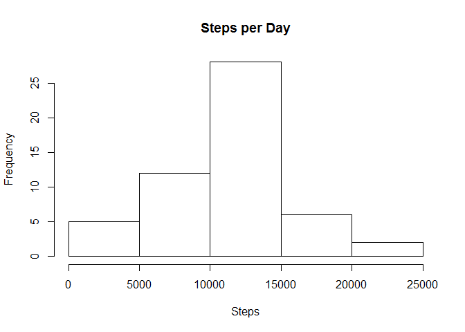
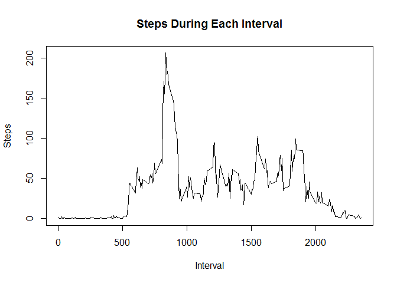
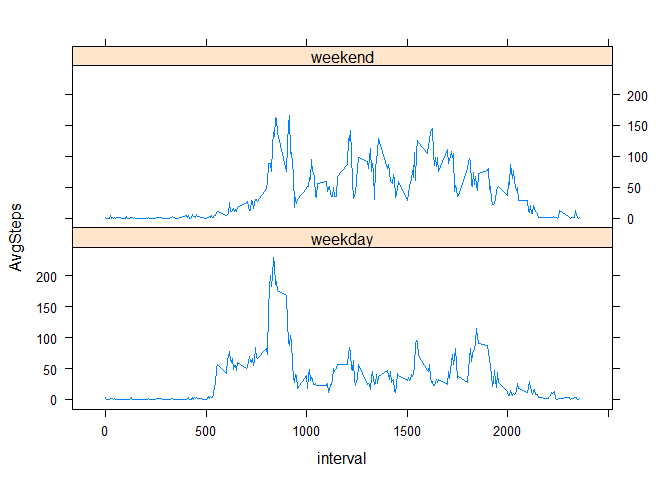

# Reproducible Research: Peer Assessment 1


## Loading and preprocessing the data

First, I will load the data that I've downloaded into my working directory and preprocess it to make sure the variables are the right class.  The default of the read.csv function for the missing values "na.strings" is "NA" which matches the missing value in the data.  


```r
Activity <-read.csv("activity.csv", stringsAsFactors = F)
Activity$date<-as.POSIXlt(Activity$date, format = "%Y-%m-%d")
Activity$date<-as.POSIXct(Activity$date)
library(dplyr)
```

```
## 
## Attaching package: 'dplyr'
## 
## The following object is masked from 'package:stats':
## 
##     filter
## 
## The following objects are masked from 'package:base':
## 
##     intersect, setdiff, setequal, union
```

```r
ActiveData<-tbl_df(Activity)
```

## What is mean total number of steps taken per day?

First, I will make a histogram of the number of steps per day after grouping the data by date.  

```r
ActiveDays<-group_by(ActiveData, date)
ActiveDaysSum<-summarize(ActiveDays, StepsSum = sum(steps))
hist(ActiveDaysSum$StepsSum, main = "Steps per Day", xlab = "Steps")
```

 
The mean was found to be 10766.19 steps per day.  The median was found to be 10765 steps per day.


```r
mean(ActiveDaysSum$StepsSum, na.rm=T)
```

```
## [1] 10766.19
```

```r
median(ActiveDaysSum$StepsSum, na.rm=T)
```

```
## [1] 10765
```

## What is the average daily activity pattern?

This time, I will group the Activity Data by the daily intervals and find the average steps for each interval accross all the days. 


```r
ActiveInt<-group_by(ActiveData, interval)
ActiveInt_Steps<-summarize(ActiveInt, Avg_Steps = mean(steps, na.rm = T))
plot(ActiveInt_Steps$interval, ActiveInt_Steps$Avg_Steps, type = "l", xlab = "Interval", ylab = "Steps", main = "Steps During Each Interval")
```

 
The interval with the highest amounts of average steps taken is 835 with an average of about 206 steps.  


```r
filter(ActiveInt_Steps, Avg_Steps == max(ActiveInt_Steps$Avg_Steps, na.rm = T))
```

```
## Source: local data frame [1 x 2]
## 
##   interval Avg_Steps
## 1      835  206.1698
```

## Imputing missing values

The number of missing data is 2304. I am going to replace each missing data with the average number of steps for that interval.  


```r
sum(is.na(ActiveData$steps))
```

```
## [1] 2304
```

```r
ActiveInt2<-mutate(ActiveInt, intmean = mean(steps, na.rm = T))
ActiveInt2$steps<-replace(ActiveInt2$steps, is.na(ActiveInt2$steps), ActiveInt2$intmean)
```

```
## Warning in replace(ActiveInt2$steps, is.na(ActiveInt2$steps),
## ActiveInt2$intmean): number of items to replace is not a multiple of
## replacement length
```

```r
ActiveDays2<-group_by(ActiveInt2, date)
sum(is.na(ActiveInt2$steps))
```

```
## [1] 0
```

Now that the number of missing value is zero and I have replaced all of them, I will again calculate the mean. 


```r
ActiveDaysSum2<-summarize(ActiveDays2, StepsSum = sum(steps))
mean2<-mean(ActiveDaysSum2$StepsSum)
mean2
```

```
## [1] 10766.19
```

```r
median2<-median(ActiveDaysSum2$StepsSum)
median2
```

```
## [1] 10766.19
```

The mean steps per day is again 10766.19.  The median ends up at 10766.19, just 1.19 higher than before the missing value replacements. 

Here is a summary of the data frame used to make sure that I did not end up with the same number of steps for each day.


```r
summary(ActiveDaysSum2)
```

```
##       date                        StepsSum    
##  Min.   :2012-10-01 00:00:00   Min.   :   41  
##  1st Qu.:2012-10-16 00:00:00   1st Qu.: 9819  
##  Median :2012-10-31 00:00:00   Median :10766  
##  Mean   :2012-10-31 00:25:34   Mean   :10766  
##  3rd Qu.:2012-11-15 00:00:00   3rd Qu.:12811  
##  Max.   :2012-11-30 00:00:00   Max.   :21194
```
## Are there differences in activity patterns between weekdays and weekends?

I will use the data frame "ActiveInt2" above with missing values replaced. It also already groups the data frame by interval.


```r
ActiveInt2$Period <- weekdays(ActiveInt2$date)
ActiveInt2$Type<-ifelse(grepl('^S', ActiveInt2$Period), "weekend", "weekday")
ActiveInt3<-group_by(ActiveInt2, interval, Type)
ActiveInt4<-summarize(ActiveInt3, AvgSteps = mean(steps))
library(lattice)
xyplot(AvgSteps ~ interval | Type, data = ActiveInt4, layout=c(1,2), type = "l")
```

 

